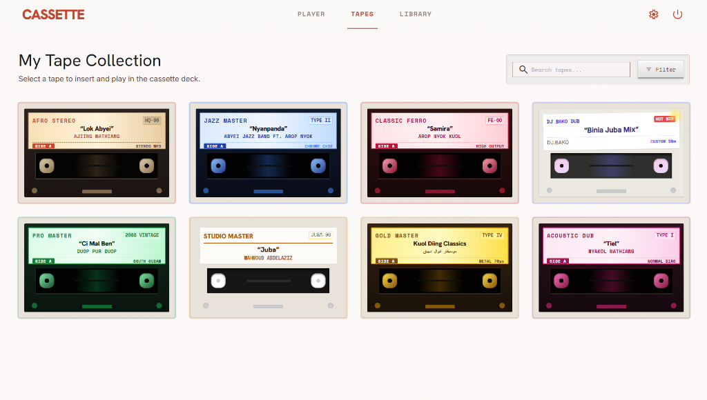

# CASSETTE

A web-based retro 80s boombox cassette player and vintage tape collection. Built entirely with vanilla HTML5, Tailwind CSS, JavaScript, and the Web Audio API without heavy frontend frameworks.

**Live Demo:** [https://malualbiar.github.io/CassetePlayer/](https://malualbiar.github.io/CassetePlayer/)

---

## Screenshots

### 1. Main Boombox Deck & 3D Orbital Cassette Stack
The main player view features a skeuomorphic boombox with rotating spindles, dancing VU meters, speaker cone bounce, mechanical transport buttons, and an interactive 3D circular cassette arch.


---

### 2. My Tape Collection
A visual gallery showing your curated cassette tape collection with vintage tape shell artwork, status badges, search filtering, and one-click insertion into the deck.



---

### 3. Cassette Storage Rack & Master Tape Log
An archival index view with realistic cassette box spines, live search, format filters (Type I Ferro, Type II Chrome, Type IV Metal, Mixtapes), and collection management controls.


---

### 4. Hi-Fi Deck Calibration: Audio FX & Tone
A slide-out calibration drawer powered by the Web Audio API. It includes synthetic analog tape hiss simulation, Dolby B noise reduction, real-time motor speed and pitch adjustment (0.85x to 1.15x), and a 3-band equalizer.


---

### 5. Custom Mixtape Recorder
Create and design personalized cassettes. Upload your own audio files (.mp3, .wav, .m4a), set the track title, artist name, shell color, and tape formula, then save it straight to your collection in localStorage.


---

### 6. Keyboard Hardware Controls
Full keyboard hotkey support for quick hardware-style playback control.


---

## Features

- **Skeuomorphic Boombox Hardware**:
  - Dark gunmetal carrying handle with a knurled rubber grip and machined pivot hinges.
  - Realistic speaker grille with bass-reactive vibrating cone animation.
  - Dual spinning tape reels with Play, Pause, Fast-Forward, and Rewind states.
  - Dual analog needle VU meters with warm amber backlighting.
  - Mechanical latched transport buttons with tactile press depths.
  - Rotary Volume and Tuning knobs with scale notches and rotational dragging.
- **3D Circular Cassette Arch**:
  - Orbital stacking layout with smooth picking-up and shift animations.
  - Color-accurate vintage cassette shells for Type I, Type II, Type IV, and custom mixtapes.
  - Tapping a tape loads it directly into the deck bay and waits for the user to press Play.
- **Hi-Fi Calibration & Audio FX**:
  - **Tape Hiss**: Authentic background magnetic tape noise (Off, Subtle, Vintage).
  - **Dolby B Noise Reduction**: High-shelf filter to dampen tape hiss.
  - **Tape Speed & Pitch (±15%)**: Real-time tape motor speed adjustment with pitch shift.
  - **3-Band Tone EQ**: Hardware tone controls for Bass (120 Hz), Mid (1 kHz), and Treble (5 kHz).
- **Themes & Lighting**:
  - **Boombox Finishes**: Retro Orange, Stealth Gunmetal, Brushed Silver, and Studio Ivory.
  - **VU Backlight Glow**: Warm Amber, Radioactive Green, and Ice Blue.
- **Uninterrupted Audio**:
  - Client-side single page routing keeps audio playing seamlessly across Player, Tapes, and Library views.
- **Master Power Standby**:
  - Master power toggle fades out audio and dims the deck backlights and LEDs into standby mode.

---

## Keyboard Shortcuts

| Key | Action |
| :--- | :--- |
| <kbd>Space</kbd> | Play / Stop audio |
| <kbd>P</kbd> | Pause / Unpause playback |
| <kbd>E</kbd> | Eject currently loaded tape |
| <kbd>[</kbd> or <kbd>←</kbd> | Rewind 10 seconds |
| <kbd>]</kbd> or <kbd>→</kbd> | Fast Forward 10 seconds |
| <kbd>↑</kbd> / <kbd>↓</kbd> | Volume Up / Down (±5%) |
| <kbd>M</kbd> | Mute / Unmute master audio |
| <kbd>O</kbd> | Master Power On / Standby |
| <kbd>S</kbd> | Open / Close Settings & Calibration drawer |

---

## Project Structure

```text
CassetePlayer/
├── index.html               # Main Player entry point (GitHub Pages root)
├── PlayerPage.html          # Standalone Player view
├── TapesPage.html           # 3D Tapes catalog view
├── LibraryPage.html         # Cassette rack & master log index view
├── style.css                # Skeuomorphic CSS styles & animations
├── .nojekyll                # Disables Jekyll processing on GitHub Pages
├── assets/
│   └── screenshots/         # Screenshots for documentation
├── js/
│   ├── audio-deck.js        # Persistent Audio Deck singleton & transport controls
│   ├── audio-effects.js     # Web Audio API filters, tape hiss, and speed controls
│   ├── settings-modal.js    # Calibration drawer, theme switch, & mixtape creator
│   ├── tape-carousel.js     # 3D circular orbiting cassette stack animation
│   ├── tape-data.js         # Tape catalog metadata & localStorage collection
│   ├── rotary-knob.js       # Rotary dial physics & rotational drag handlers
│   ├── player-app.js        # Main Player view lifecycle controller
│   ├── tapes-app.js         # Tapes grid lifecycle controller
│   ├── library-app.js       # Library rack & table lifecycle controller
│   ├── transitions.js       # Seamless SPA view swap router
│   └── tailwind-config.js   # Tailwind typography & color tokens
└── music/                   # Audio asset files (.mp3)
```

---

## Getting Started

### Local Development
1. Clone the repository:
   ```bash
   git clone https://github.com/malualbiar/CassetePlayer.git
   cd CassetePlayer
   ```
2. Serve locally with any static HTTP server:
   ```bash
   # Using Python 3
   python -m http.server 8000

   # Or using Node.js
   npx serve .
   ```
3. Open `http://localhost:8000` in your browser.

---

## License

This project is licensed under the [MIT License](LICENSE).
