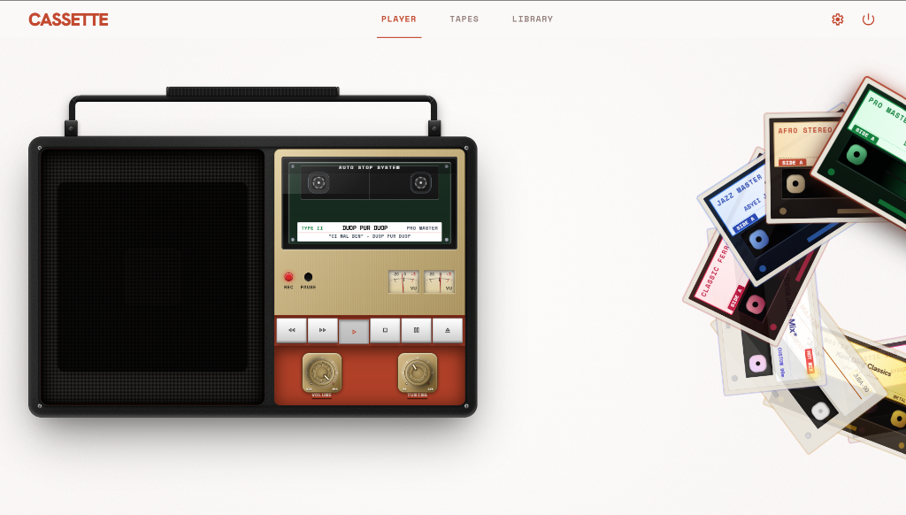
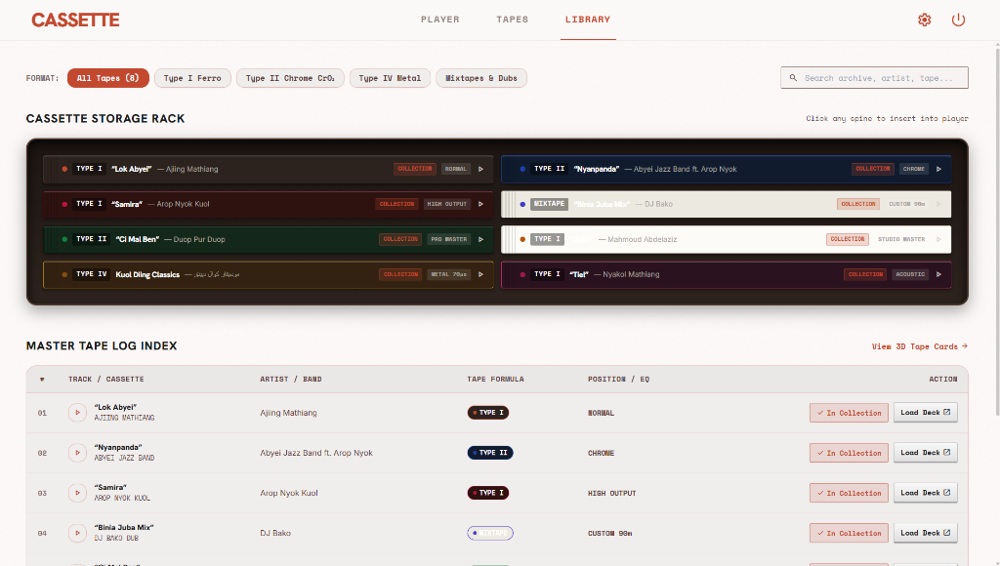
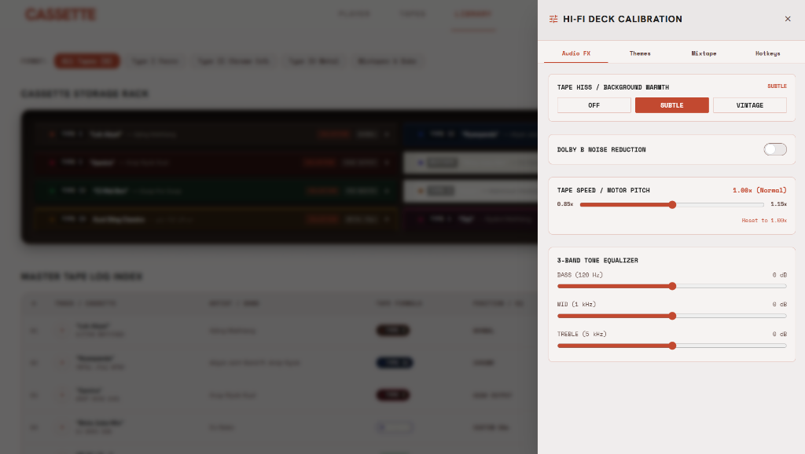
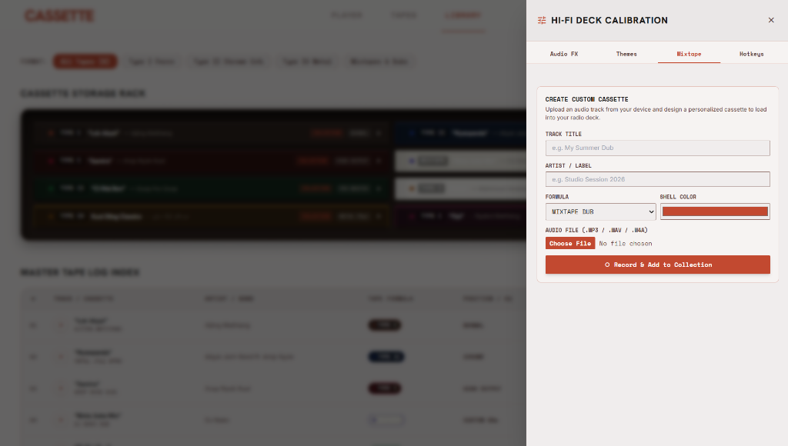
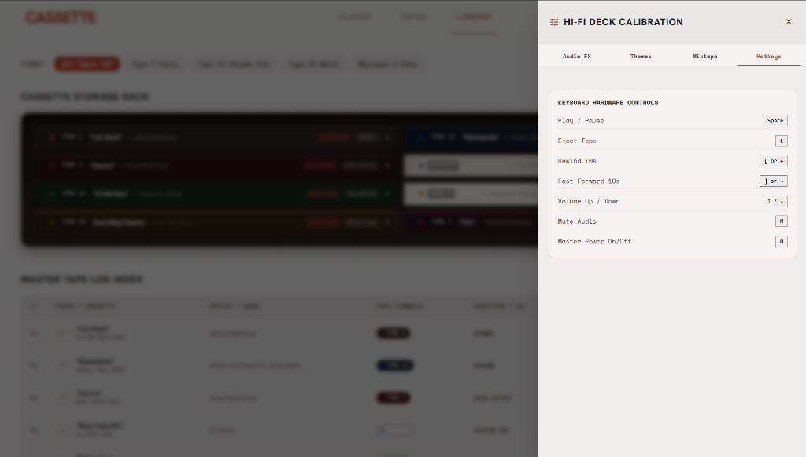

# 📼 CASSETTE — Retro 80s Skeuomorphic Hi-Fi Tape Deck

An authentic, tactile, web-based retro 80s boombox cassette player and vintage music library. Built with pure HTML5, Tailwind CSS, JavaScript, and the Web Audio API with zero heavy framework overhead.

---

## 📸 Screenshots & Overview

### 1. Main Deck & 3D Orbital Cassette Stack
Experience a fully skeuomorphic boombox with rotating spindles, dancing VU meters, speaker cone bounce, mechanical transport buttons, and a 3D circular orbiting cassette arch.



---

### 2. Cassette Storage Rack & Master Tape Log Index
Browse your cassette catalog with realistic cassette box spines, live search, format filters (Type I Ferro, Type II Chrome, Type IV Metal, Mixtapes), and a master log index table.



---

### 3. Hi-Fi Calibration: Analog Audio FX & Tone
Shape your sound using Web Audio API nodes: synthetic analog tape hiss simulation, Dolby B noise reduction, real-time motor speed / tape pitch tuning (`0.85x`–`1.15x`), and a 3-band equalizer.



---

### 4. Custom Mixtape Recorder
Upload your own audio tracks (`.mp3`, `.wav`, `.m4a`), personalize your cassette shell color, track title, artist name, and formula, and save it directly to your permanent collection in `localStorage`.



---

### 5. Keyboard Hardware Controls
Full keyboard hotkeys support for an authentic hardware feel:



---

## ✨ Key Features

- **📻 Skeuomorphic Radio Chassis**:
  - Dark gunmetal carrying handle with a knurled rubber grip and machined pivot hinges.
  - Realistic speaker grille with bass-reactive vibrating cone animation.
  - Dual spinning tape reels with Play, Pause, Fast-Forward, and Rewind states.
  - Dual analog needle VU meters with warm amber backlighting.
  - Mechanical latched transport buttons with realistic tactile press depths.
  - Circular rotary Volume and Tuning knobs with scale notches and rotational dragging.
- **🌀 3D Orbital Cassette Arch**:
  - Interactive circular stacking layout with smooth picking-up and shift animations.
  - Color-accurate vintage cassette shells for Type I (Normal Bias), Type II (Chrome CrO2), Type IV (Metal), and custom mixtapes.
  - Tapping a tape loads it directly into the deck bay and waits for the user to press Play.
- **🎛️ Hi-Fi Calibration & Audio FX**:
  - **Tape Hiss**: Authentic background magnetic tape noise (`OFF`, `SUBTLE`, `VINTAGE`).
  - **Dolby B Noise Reduction**: High-shelf filter to dampen tape hiss.
  - **Tape Speed / Pitch Adjust (±15%)**: Real-time tape playback speed and analog pitch shifting.
  - **3-Band EQ**: Hardware tone controls for Bass (120 Hz), Mid (1 kHz), and Treble (5 kHz).
- **🎨 Themes & Lighting**:
  - **Boombox Finishes**: *Classic Retro Orange*, *Stealth Gunmetal*, *Brushed Silver*, and *Studio Ivory*.
  - **VU Backlight Glow**: *Warm Amber*, *Radioactive Green*, and *Ice Blue*.
- **⚡ Uninterrupted Playback (SPA Router)**:
  - Seamless client-side SPA routing so audio playback never cuts out when switching between Player, Tapes, and Library screens.
- **⏻ Master Power Standby**:
  - Power toggle fades out audio and dims the deck backlights and LEDs into standby mode.

---

## ⌨️ Keyboard Shortcuts

| Key | Action |
| :--- | :--- |
| <kbd>Space</kbd> | **Play / Stop** audio |
| <kbd>P</kbd> | **Pause / Unpause** playback |
| <kbd>E</kbd> | **Eject** currently loaded tape |
| <kbd>[</kbd> or <kbd>←</kbd> | **Rewind** 10 seconds |
| <kbd>]</kbd> or <kbd>→</kbd> | **Fast Forward** 10 seconds |
| <kbd>↑</kbd> / <kbd>↓</kbd> | **Volume Up / Down** (±5%) |
| <kbd>M</kbd> | **Mute / Unmute** master audio |
| <kbd>O</kbd> | **Master Power** On / Standby |
| <kbd>S</kbd> | Open / Close **Settings & Calibration** drawer |

---

## 📂 Project Structure

```text
CassetePlayer/
├── index.html               # Main Player entry point (GitHub Pages root)
├── PlayerPage.html          # Standalone Player view
├── TapesPage.html           # 3D Tapes catalog view
├── LibraryPage.html         # Cassette rack & master log index view
├── style.css                # Skeuomorphic CSS styles & animations
├── .nojekyll                # Disables Jekyll processing on GitHub Pages
├── assets/
│   └── screenshots/         # Documentation & README screenshots
├── js/
│   ├── audio-deck.js        # Persistent Audio Deck singleton & transport controls
│   ├── audio-effects.js     # Web Audio API filters, tape hiss, and speed controls
│   ├── settings-modal.js    # Calibration drawer, theme switch, & mixtape creator
│   ├── tape-carousel.js     # 3D circular orbiting cassette stack animation
│   ├── tape-data.js         # Tape catalog metadata & localStorage collection
│   ├── rotary-knob.js       # Rotary dial physics & rotational drag handlers
│   ├── player-app.js        # Main Player view lifecycle controller
│   ├── tapes-app.js         # Tapes grid lifecycle controller
│   ├── library-app.js       # Library rack & table lifecycle controller
│   ├── transitions.js       # Seamless SPA view swap router
│   └── tailwind-config.js   # Tailwind CSS typography & color palette tokens
└── music/                   # Audio asset files (.mp3)
```

---

## 🚀 Getting Started

### Local Setup
1. Clone the repository:
   ```bash
   git clone https://github.com/malualbiar/CassetePlayer.git
   cd CassetePlayer
   ```
2. Serve locally with any static HTTP server (e.g. VS Code Live Server, Python HTTP server, or `npx serve`):
   ```bash
   # Using Python 3
   python -m http.server 8000

   # Or using Node.js
   npx serve .
   ```
3. Open `http://localhost:8000` in your browser.

---

## 📜 License

This project is licensed under the [MIT License](LICENSE).
